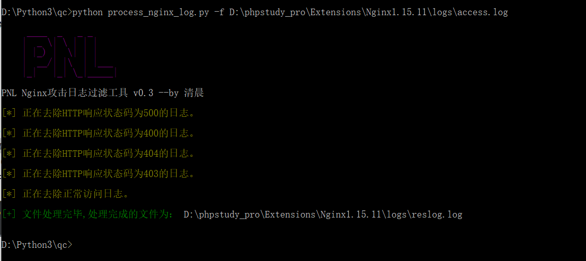
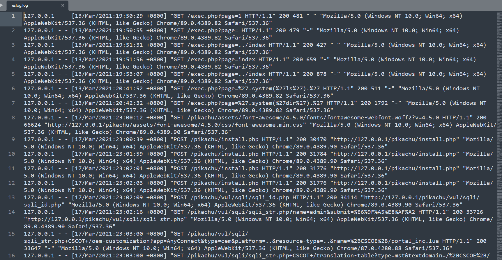
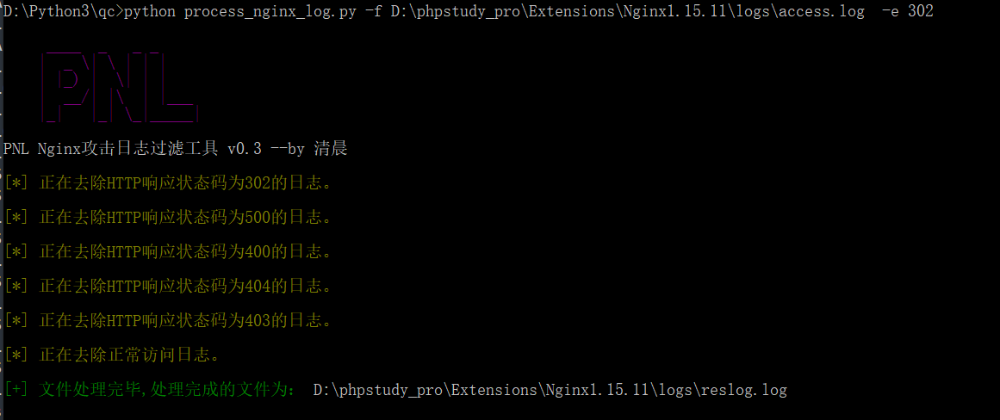
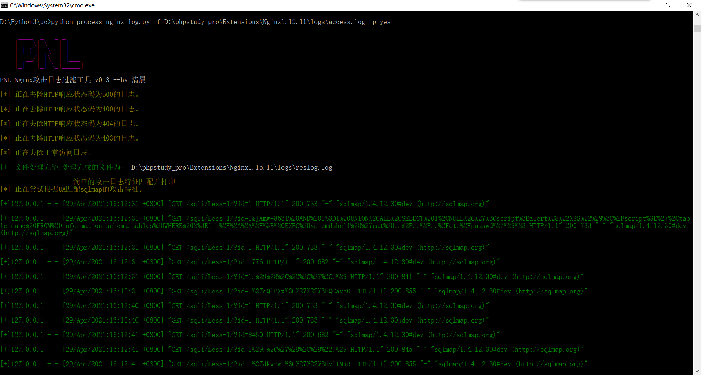

# PNL 工具介绍

本工具为Nginx默认日志的简单过滤工具。

减少大日志分析的难度，尽量（嘛，只能是尽量）帮助管理员在大日志中找到攻击成功的日志。

工具的原理在于去除大日志中的404、403等日志和一些正常访问日志。

 一般用于ctf题中的大日志分析题。

嘛，我也写不出啥好工具，毕竟我的技术水平你也知道的。

而且这个工具其实挺鸡肋的，为啥这样说，因为在实际的应急响应中会根据异常事件来排查日志，比如说你首页被串改了，那么可以根据修改index的时间来找对应的前后那段时间的日志，而不是看那么大的Nginx日志。再比如说你被上传了webshell啥的，查杀到webshell后也是看webshell的创建时间到日志中对应大概的那段时间来排查的，因此在大日志中找攻击成功者的IP这样的东西一般就ctf题。

而且我这个工具吧，只能尽量的去掉那些不是攻击或者攻击没成功的日志，但是可能过滤后日志依然很大，所以挺鸡肋的。

但是我为啥还要写呢？练手呗，因为之前打比赛遇到了一个题就是在10几MB的日志里找攻击成功者的IP，当时我就看到一个挺像，然后一看状态码404，哎呀呀，烦！然后我就用Linux的grep来筛选把404、403等等那些去掉，麻烦。

最后依然没有找到攻击成功者的IP，后面做出来的大佬们说状态码是302，嘛。也对比赛嘛。如果是200那就太难了。

然后我就想着写一个脚本，至少给自己减少一些非攻击的日志。把日志量缩小才写的这个脚本。

嘛。总之就是练练手。

# 工具使用

使用前先安装argparse模块和colorama模块。
```
pip install argparse
pip install colorama
```

使用方法：

```
python process_nginx_log.py [options]
	-f logname # 指定日志文件路径，必须参数。
	-e httpResponseCode # 指定排除的http响应状态码。
	-p yes # 打印匹配到的攻击指纹，默认为no。
```


默认的使用方法：

```
python process_nginx_log.py -f 日志文件路径
```





指定去除的http响应状态码的日志：

```
python process_nginx_log.py -f logPath  -e code
```



打印攻击日志：

``` 
python process_nginx_log.py -f logPath  -p yes
```



打印攻击日志功能，只是简单的根据user-agent来匹配sqlmap和蚁剑的特征打印出来。
